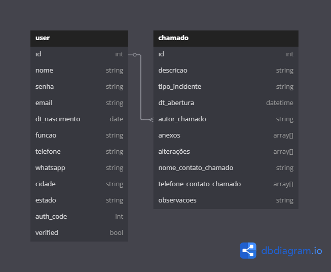

  <h1 align="center">BrainStorm</h1>

  

## O Projeto

BrainStorm é um sistema de gerenciamento de chamados em PHP, onde é possível criar e gerenciar chamados de TI. O projeto é usado em conjunto com o uso do pacote XAMPP para desenvolvimento PHP.

## Diagrama do Banco

## Bibliotecas

Para envio do código de segurança via email, foi utilizada a biblioteca PHPMailer em conjunto com um email na plataforma GMail.

## Rotas

* http://localhost/brainstorm/ - Aplicação
* http://localhost/phpmyadmin/ ou http://127.0.0.1/phpmyadmin/ - Painel do phpMyAdmin
